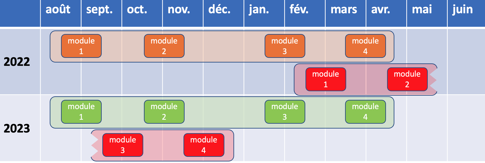
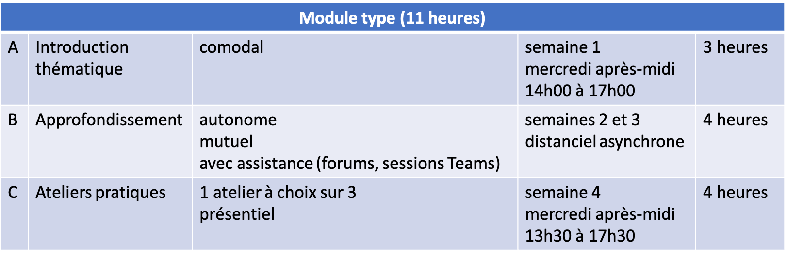

```{r setup, include=FALSE}
options(htmltools.dir.version = FALSE)
knitr::opts_chunk$set(
  fig.width=9, fig.height=3.5, fig.retina=3,
  out.width = "100%",
  cache = FALSE,
  echo = TRUE,
  message = FALSE, 
  warning = FALSE,
  fig.show = TRUE,
  hiline = TRUE
)
```

```{r xaringan-themer, include=FALSE, warning=FALSE}
library(xaringanthemer)
style_duo_accent(
  primary_color = "#D2202B",
  secondary_color = "#D2202B",
  inverse_header_color = "#FFFFFF",
  link_color = "#676C72",
    header_font_google = google_font("Josefin Sans")

)
```

class: title-slide, inverse, bottom
background-image: url(`r rmarkdown::metadata$url_unsplash`)
background-size: cover

# `r rmarkdown::metadata$title`

## `r rmarkdown::metadata$subtitle`

### `r rmarkdown::metadata$team`

### `r rmarkdown::metadata$date`

---
class: about-me, middle, center


## Formation continue HEP-VS

[`r icons::fontawesome("link")` `r basename(rmarkdown::metadata$url_website)`](`r rmarkdown::metadata$url_website`)</br>
[`r icons::fontawesome("user-lock")` Stockage du projet (RII)](`r rmarkdown::metadata$url_intranet`)
---
class: , middle left

### Rappel du contexte et commande de base

--

### Etat d'avancement général du projet

--

### Présentation du concept de formation

--

### Parcours de formation des ES

--

### Stratégie de recrutement des équipes de formation

--

### Discussion et Décisions

--

### Prochains jalons (go / no go)

--

### La question des organes liés à la formation

--

### Divers


---

class: title-slide, inverse, middle
background-image: url("https://images.unsplash.com/photo-1516321497487-e288fb19713f?ixid=MnwxMjA3fDB8MHxwaG90by1wYWdlfHx8fGVufDB8fHx8&ixlib=rb-1.2.1&auto=format&fit=crop&w=1950&q=80")
background-size: cover

## Rappel du contexte et commande initiale

---

class: middle left, inverse
background-color:#D2202b

## Rappel du contexte

- Demande de formation par l'OES (premiers contacts en automne 2020)

--

- HEP-VS en phase d'accréditation institutionnelle (autonomie)

--

- Volonté de présenter un *produit excellent* pour un public exigeant

---


class: middle left, inverse
background-color:#D2202b

## Commande de l'OES (novembre 2020)

--

- Formation obligatoire de 44 heures

--

- Abordant les notions de :

--

1. connaissances des troubles (aspects de neurosciences),

--

1. spécificités de l'autisme, 

--

1. utilisation d'outils d'évaluation et de remédiation

--

[`r icons::fontawesome("link")` Document Excel remis par l'OES](https://rms.hepvs.ch/repository/4-weiterbildung/5-einmalige-weiterbildungsangebote/formation-continue-des-enseignants-specialises/dossier-23007/document-155460)

---

class: title-slide, inverse, middle
background-image: url("https://images.unsplash.com/photo-1434626881859-194d67b2b86f?ixid=MnwxMjA3fDB8MHxwaG90by1wYWdlfHx8fGVufDB8fHx8&ixlib=rb-1.2.1&auto=format&fit=crop&w=1953&q=80")
background-size: cover

## Etat d'avancement général du projet

---

class: middle

## Etat d'avancement général du projet &#x1F7E2;

--

- Coordination HEP-VS et SE (finances) &#x1f7e0;

--

- Fonctionnement du groupe de pilotage &#x1F7E2;

--

- Projet de formation (fiche-projet) &#x1F7E2;

--

[`r icons::fontawesome("link")` Fiche-projet relative à la formation continue ES](https://rms.hepvs.ch/repository/4-weiterbildung/5-einmalige-weiterbildungsangebote/formation-continue-des-enseignants-specialises/dossier-23007/document-154181)

---


class: title-slide, inverse, middle
background-image: url("https://images.unsplash.com/photo-1476480862126-209bfaa8edc8?ixid=MnwxMjA3fDB8MHxwaG90by1wYWdlfHx8fGVufDB8fHx8&ixlib=rb-1.2.1&auto=format&fit=crop&w=1650&q=80")
background-size: cover

## Présentation du concept de formation

---

class: middle

## Présentation du concept de formation

### Sous le capot...

--

Nous formons des professionnel·les du terrain. En ce sens, tout le cursus est articulé avec 3 ingrédients :

--

- Connaître et comprendre (les bases théoriques)

--

- Mettre en œuvre (les programmes et outils)

--

- Enrichir le répertoire commun avec les connaissances actuelles de la recherche (par les communautés de pratiques, foires aux pratiques, intervisions)

--

### Visées 

--

-	Développement des capacités transversales (au sens du PER) des élèves ;

--

-	Connaissances d’aspects de neurosciences dans le développement de l’être humain ;

--

-	Connaissance et prise en charge des troubles du spectre de l’autisme.

---

class: middle

## Présentation du concept de formation

### Les valeurs qui sous-tendent la formation

--

.pull-left[
### - Participation
### - Autonomie
### - Excellence
]

--

.pull-right[
### - Technologie adaptée
### - Orientation client·e
### - Impact sur les pratiques
]
--

### Quelques données

- Nombre de personnes à former : 300 - 400 (?) personnes
- Nombre d'heures de formation par personne : 44 heures 

---

## Parcours de formation

### les sessions

--

- 3 sessions à choix couvrant août 2022 à avril 2024

--

- Chaque session couvre l'entièreté de la formation

--

- Chaque session contient 4 modules.

--

- Une session équivaut donc à un parcours de formation.

--

- Chaque session est introduite et conclue par avec un message de l'OES.

--

### les modules

--

- Les modules sont des entités organisée autour d'un thème;

--

- Un module couvre : connaître/comprendre, utiliser, partager/enrichir;

--

- Un module se découpe en 3 parties.

---

## Parcours de formation

### 3 sessions pour 3 parcours de formation



---

## Parcours de formation

### Les modules comme principe actif de la formation
- Un collaboration HEP-VS et autorités scolaires pour le questionnement des pratiques (partie C)
- Un pilotage de la HEP-VS garanti (partie C)



---

## Parcours de formation

### Anatomie d'un module

--

- A - introduction thématique : par l'équipe de formation, en comodal, avec portée académique, max. 200 personnes.

--

- B - Approfondissement : par la personne formée, sur une plateforme d'apprentissage, dépôt de ressources, activités de feedbacks (quizz, ...), avec assistance asynchrone de l'équipe de formation

--

- C - Ateliers pratiques : en présentiel, avec les pair·es, en groupes homogènes restreints de 15 personnes, 14 ateliers max en parallèle, animation par un·e responsable ES, autour d'études de cas (partage de pratiques, questionnement des pratiques)

--

La partie C est cruciale. C’est dans cette partie que les enseignant·es spécialisé·es vont confronter leurs croyances du fonctionnement de l’ES, des cultures d’établissement, des démarches réaslisées sur le terrain, avec les nouvelles connaissances. La partie C est donc capitale pour l’appropriation des connaissances et outils à des fins de mise en œuvre. 

---

class: inverse

## Parcours de formation - Contenus des 4 modules

--

.pull-left[

A l'origine 8 thèmes...

- Connaître les actualités scientifiques.

- Travailler en réseau et utiliser adéquatement le diagnostic.

- Connaître les actualités en ce qui concerne le TSA.

- Connaître les outils d'analyse des expert·es

- Construire un projet adéquat (global/spécifique)

- Découvrir et utiliser des outils d'intervention

- Prendre en compte et évaluer les compétences transversales

- Déterminer le type d'approche à privilégier (global/spécifique)

]

--

.pull-right[

...regroupés en 4 modules.

- Eléments de psychologie cognitive (attention, mémoire, autres fonctions exécutives)

- TSA : du diagnostic aux interventions

- Eléments de sciences affectives : le développement émotionnel et les compétences psychosociales

- Développer un projet d'intervention : entre risques et opportunités

]
---


class: title-slide, inverse, middle
background-image: url(https://images.unsplash.com/photo-1503676260728-1c00da094a0b?ixid=MnwxMjA3fDB8MHxwaG90by1wYWdlfHx8fGVufDB8fHx8&ixlib=rb-1.2.1&auto=format&fit=crop&w=1609&q=80)
background-size: cover

## Stratégie de recrutement des équipes de formation

---

## Stratégie de recrutement des équipes de formation

<!-- ### Personnes pressenties -->

--

### Institutions pressenties

--

- HEP-VS
- UniDistance
- HEP Vaud
- UNIFR
- Autres (privé, UNIGE)

<!-- -- -->

<!-- - HEP-VS (Elena Lucciarini, Sylvie Richard, Pierre Vianin) -->

<!-- -- -->

<!-- - UniDistance (Andrea C. Samson) -->

<!-- -- -->

<!-- - HEPL ( ??? , Rachel Sermier Dessemontet, de Chambrier Anne-Françoise, ???) -->

<!-- -- -->

<!-- - UNIFR (Lionel Alvarez, Genevière Petitpierre, Myriam Squillaci, Olivier Jorand ) -->

<!-- -- -->

<!-- - Autres institutions (Cherine Fahim, David Sander, ...) -->

<!-- -- -->

### Processus de recrutement

--

1. Equipes de formation : à réaliser avant décembre 2021

--

1. Cadres de l'ES en Valais : à réaliser avant avril 2022

---

class: title-slide, inverse, middle
background-image: url("https://images.unsplash.com/photo-1533073526757-2c8ca1df9f1c?ixlib=rb-1.2.1&ixid=MnwxMjA3fDB8MHxwaG90by1wYWdlfHx8fGVufDB8fHx8&auto=format&fit=crop&w=1650&q=80")
background-size: cover

## Discussion et Décisions

---

class: middle

## Questions particulières

--

- Quel est le public-cible précisément ? Quelles sont les catégories ? Combien de personnes sont touchées ?
 
--

- Participation uniquement aux conférences pour les enseignant·es en formation ?

--

- Quel·les sont les élèves visé·es ? Elèves de l'API ordinaire, renforcé ? Tous les élèves (rôle de personne-ressource de l'ES) ?

---

class: middle

## Prochains jalons go / no go

--

- Septembre 2021 : validation financière du projet, validation du concept de formation

--

- Octobre 2021 : démarrage des organes de formation

--

- Janvier 2022 : Validation des équipes de formation

--

- Février 2022 : Validation de la première communication aux ES par l'OES sur proposition de la HEP-VS

---
class: middle, inverse

## Précisions sur les organes de la formation

--

### Le comité d’organisation

--

### Le comité scientifique

--

### Le groupe consultatif

---

class: middle, inverse

## Précisions sur les organes de la formation

### Le comité d’organisation :

--

-	Travaille en continu
-	Est composé des membres du personnel HEP-VS
-	Conceptualise la formation
-	Met en œuvre la formation
-	Assure le lien avec le mandataire
-	Gère le budget
-	Communique aux parties prenantes
-	Décide sur les aspects administratifs et opérationnels
-	…

---

class: middle, inverse

## Précisions sur les organes de la formation

### Le comité scientifique :

--

-	Se réunit chaque trimestre, soit 4 fois par an
-	Est composé des membres du personnel HEP-VS et d’expert·es externes
-	Valide les contenus de formation
-	Désigne les intervenant·es
-	Se prononce sur les demandes particulières (équivalences, VAE, …)
-	Décide sur les aspects scientifiques, pédagogiques et académiques (parcours de formation, etc)
-	…

---

class: middle, inverse

## Précisions sur les organes de la formation

### Le groupe consultatif :

--

-	Se réunit chaque semestre, soit 2 fois par an
-	Est composé de représentant·es des parties prenantes (OES, AMES, HEP-VS, …)
-	Se prononce sur le déroulement de la formation
-	Propose des régulations
-	Soutient l’amélioration continue
-	A voix consultative
-	…


---

class: middle 
<!--
class:bottom inverse
background-image: url(fit.png)
background-size: contain
background-position: left
-->


## Merci pour votre attention !

.left-column[


]


--

.right-column[


Crédits photo par ordre d'apparition :

[Brighton, velká británie](https://unsplash.com/photos/fJ6r_mkHrsw)

[John Schnobrich](https://unsplash.com/photos/2FPjlAyMQTA)

[Firmbee.com](https://unsplash.com/photos/jrh5lAq-mIs)

[Bruno Nascimento](https://unsplash.com/photos/PHIgYUGQPvU)

[Element5 Digital](https://unsplash.com/photos/OyCl7Y4y0Bk)

[Javier Allegue Barros](https://unsplash.com/photos/C7B-ExXpOIE)

]

